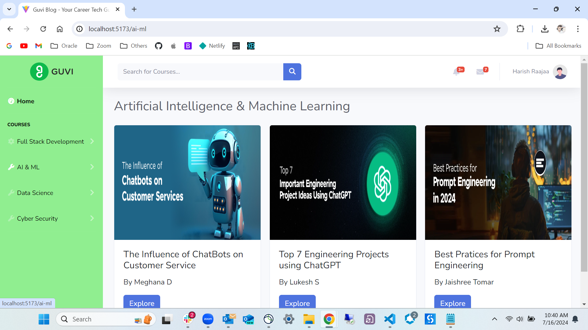

# Day - 24 Task (React Router)

Task Q : The objective of this task is to create a web page with routes using react-router-dom. The design of the page should be based on the following URL: https://www.guvi.in/blog/

Deployed URL: https://guviblog-harishcorp.netlify.app/

Comments: Screenshot given in the Task doc is different as per the provided URL. So condidered the new UI of Guvi Blog to acheive the React Router concept.

Components created:
1. Fsd.jsx
2. Ds.jsx
3. Aiml.jsx
4. Cyber.jsx
5. Cardicon.jsx ( Re-used in all the above components)
6. Home.jsx ( Re-used in all the above components)
7. Sidebar.jsx ( Re-used in all the above components)
8. Topbar.jsx ( Re-used in all the above components)
